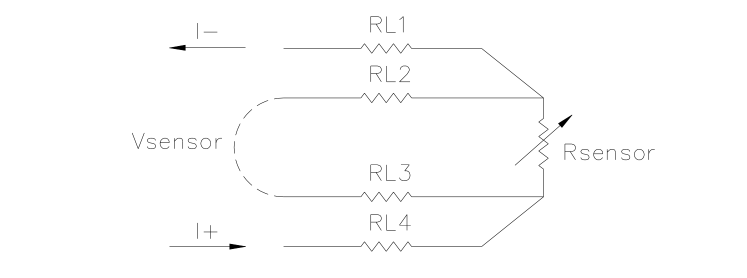
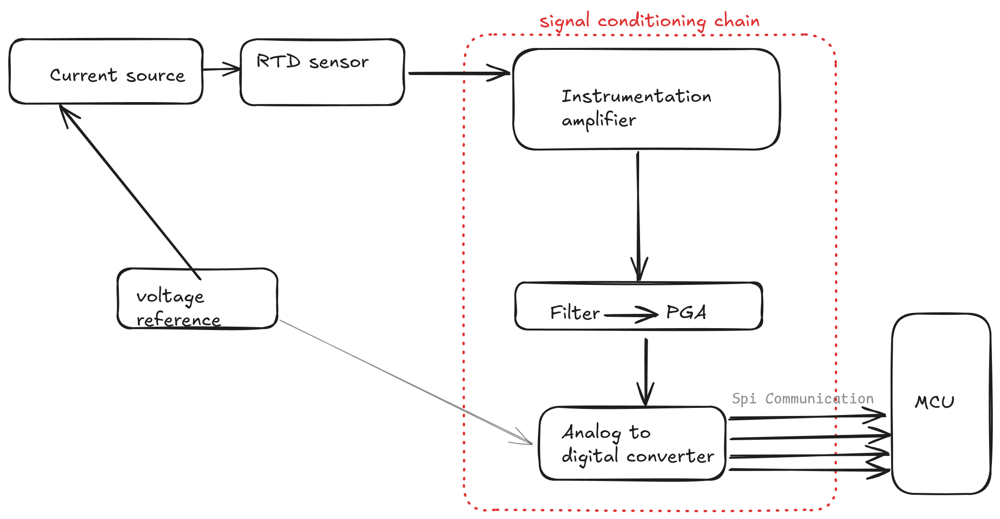
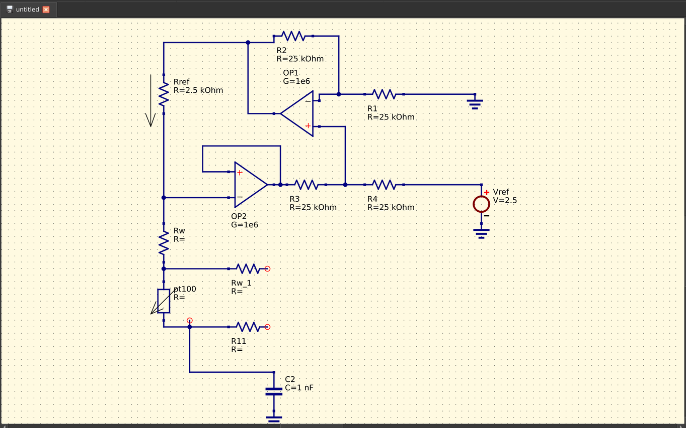
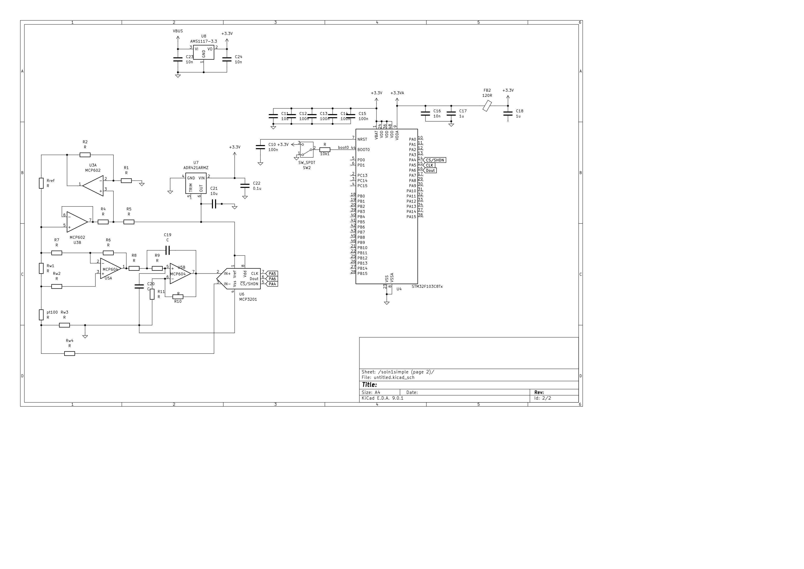
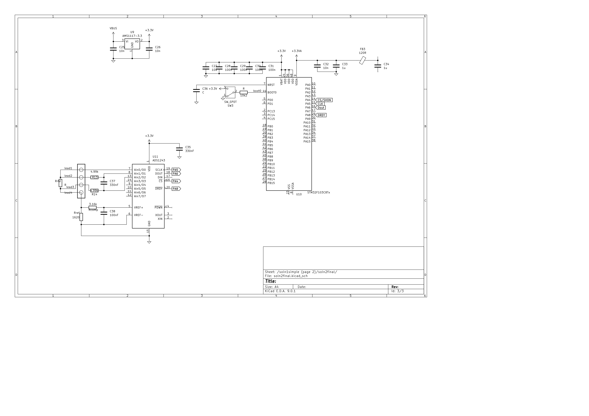
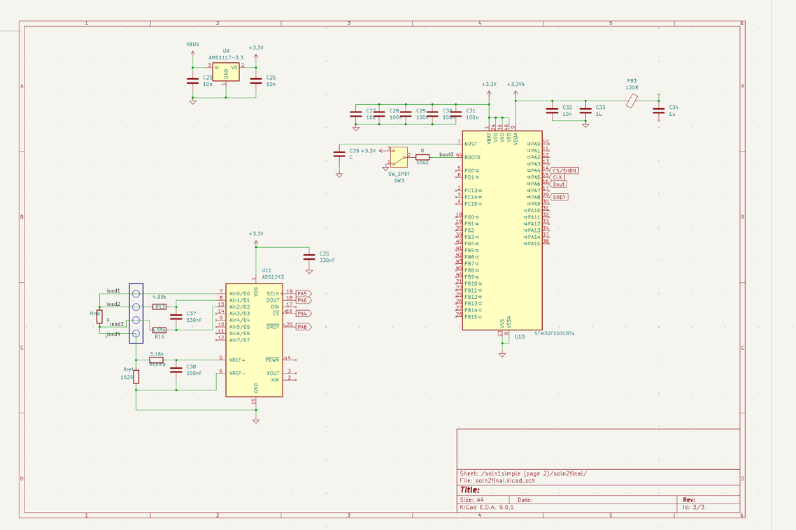

# RTD Custom module design rationale

## Contents

1. [Introduction](#1-introduction)
2. [Hardware design choices](#2-hardware-design-choices)
3. [Software design choices](#3-software-design-choices)
4. [Conclusion](#4-conclusion)

## Introduction
Temperature measurement is a common operation in many industries. There are multiple ways to collect and record temperature measurements in a digital format. One such way is to use RTD sensors.

### What is an RTD?

An RTD is a resistance temperature detector. It's resistance changes as the ambient temperature changes. The relationship between the resistance and the temperature is approximately "linear". It offers the best linear response of any temperature sensor.

They are built to standadized curves and tolerances, The most common one is the DIN curve. The DIN curve is defined by the following equation:
$$R_{RTD} = R_0(1 + \alpha T)$$
Where $R_{RTD}$ is the resistance of the RTD, $R_0$ is the resistance at 0°C, and $\alpha$ is the temperature coefficient. The temperature coefficient is  the change in resistance per degree Celsius. The temperature coefficient is typically 0.00385 for the DIN curve.

## Hardware design choices
The challenge presented to me was to design a module that converts the raw resistance data to temp readings. using the 4 wire connection configuration.



My initial instinct was to immediately design a board integrating the max31865 with the stm32f103. But shortly afterward a key technical specifiaction was sent.

> Design the module from first principles without relying on off the shelf solutions.

In this hardware section I will explain my thought process and eventual deisgn choices.

### Resistance to digitial conversion process flow.

{width=80%}

From the general process flow, I had two solutions to the hardware desing problem.

### solution 1
This was my default solution and follows the above diagram religiously.

#### current source design



the circuit was first drawn to simulate the noise characteristics of the current source using _ngspice_. This above circuite provides 1 mA current through the pt100 resistor. If the current for whatever reason exceeds the 1mA ceiling, the sensors will begin self heating and the readings will be inaccurate. but this was mitigated as shown below.

The output voltage of the operational amplifier OP1 can be expressed as:

$$VOUTA1 = \frac{R2}{R1} \times (VREF) + (VR4)$$

$$VOUTA1 = VREF \times \left(\frac{R2}{R1}\right) - (VR4)$$

where:
- $VOUTA1$ is the voltage at the output of A1
- $VR4$ is the voltage drop across R4

$$VRREF = VOUTA1 - VOUTA2$$

$$VRREF = VREF \times \left(\frac{R2}{R1}\right) - (VR4) - VREF - (VR3) - (VR4)$$

$$VRREF = VREF$$

where:
- $VRREF$ is the voltage across the reference resistor, $RREF$ and,
- $VR3$ is the voltage drop across R3

From the above the current through the rtd is given by
$$I_{RTD} = \frac{VREF}{RREF}$$
this setup produces a current source that is ratiometric to the voltage source(Vref) any changes in the ambient temperature will not affect the current source because of internal compensation. the voltage reference used for the current source is what is also fed into the ADC.

#### signal conditioning path

The choice of microcontroller is one from the stm32 series. This boards are industrial grade, low power and have high clock speeds. On top of that the specific mcu I chose has ESD protection within it.

The current generator circuit excites the sensor. an additional operational amplifier zeros the wire resistance error. The fourth amplifier is a second order low pass filter. It gains the signal and filters possible alias interference. A 12 bit converter converts the voltage across the RTD to digital code for the stm32 microcontroller.

This solution had various shortcomings.

1. despite the voltage reference being able to produce a variable reference voltage, the isolation capacitor between the leads of pt100 doesnt change its value. A consequence of this is that, when using the pt100 the nominal current value should be 1mA but when using the pt1000 the excitation current should be 0.1mA. If we manage to change the excitation current to 0.1mA but the capacitor value remains the same(1nF), the voltage across the pt1000 will be 10 times smaller than the voltage across the pt100. This will result in a loss of resolution. Thus this solution doesnt achieve a key deliverable of being able to accomodate both pt100 and pt1000 sensors.

2. The 12 bit resolution of the adc is not enough to achieve the required resolution of 0.01°C. This is because the pt100 has a temperature coefficient of 0.00385. This means that the resistance of the pt100 changes by 0.00385 ohms per degree Celsius.

### solution 2
Using the ADS124s08 which is a 24 bit ADC with a PGA and an internal reference. It belongs to a family of IC's known as Analog front ends which I didnt know existed and how much they simplify analog design.

The circuit is pretty straightforward. A voltage source powers the ADC and a voltage divider is used to excite the sensor. The output of the sensor is connected to the ADC. The ADC converts the voltage to a digital code which is then sent to the microcontroller. The microcontroller then converts the digital code to a temperature reading.



Using a ratiometric measurement, the ADC output
code does not need to be converted to a voltage. This means that the output code gives a measurement only as
a ratio of the value of the reference resistor and does not require a precise value for the excitation current. The
only requirement is that the current through the RTD and reference resistor are the same.

Equations for the measurement conversion of a 24-bit ADC:

$$\text{Output Code} = 2^{23} \times \text{Gain} \times \left(\frac{V_{RTD}}{V_{REF}}\right) = 2^{23} \times \text{Gain} \times \frac{I_{IDAC1} \times R_{RTD}}{I_{IDAC1} \times R_{REF}} = 2^{23} \times \text{Gain} \times \left(\frac{R_{RTD}}{R_{REF}}\right)$$

$$R_{RTD} = R_{REF} \times \left[\frac{\text{Output Code}}{(\text{Gain} \times 2^{23})}\right]$$

The ADC converts the measurement to the RTD equivalent resistance. Because of non-linearity in the RTD
response, the conversion of the resistance to temperature requires a calculation from equation or look-up
table. Which I have considered in the software section.

alternatives I could have used include. AD7124-4/AD7124-8, AD7799, AD7798, AD7797, AD7796. but most of them got disqualified because of max operating temperature.

#### design goals
1. does my design accomodate both sensors?
   > *Yes, the excitation current can be switched by an internal register on the ADC. this allows the user to switch between the two pt sensors.*

2. Does my design mitigate noise and self heating?
   > *Yes, the design uses a low pass filter to mitigate noise. The excitation current is also switched to a lower value when the pt1000 is used. This mitigates self heating.*

3. Does my design ensure reliable operation even at high ambient temperatures?
   > *Yes, the design uses a voltage reference to ensure reliable operation even at high ambient temperatures. the second design has a self calibrating voltage reference based on the ambient temperature.*

   > *I did not consider other thermal design considerations on the PCB traces.*

## Software design choices
the complete code for this section is in this github [repo](https://github.com/shawn-phy/rtd_firmware)
The SPI communication is initialized in a very standard way across most microcontrollers. However since I was required to use the board from first principles, I opted for CMSIS LL. This was very challenging since the instructions about initializeing SPI are deep inside an 1800 page technical reference.

I used my Nucleof429ZI board(not the same one used in the schematic) to verify/debug the SPI communication with a generic SPI sensor. Once this was succesful. The next bit(pun intended) was to handle the conversion. there were several options.

1. Using a lookup table.
2. Callendar-van Dussen calculation
3. Cubic eqn calculation
4. 5th order polynomial calculation
5. Ugly rational polynomial quotient.


Using inspiration from [this library](https://github.com/drhaney/pt100rtd/blob/master/pt100rtd.cpp) I wrote functions for conversion of the resistance to temperature.

#### Automatic RTD Type Detection

This rtd implementation includes functionality to automatically detect between Pt100 and Pt1000 sensors based on the resistance value:

```c
float resistance = readSensorResistance();

// Simple auto-detection based on resistance value
if (resistance > 400.0) {
    // most likely a Pt1000 sensor
    sensor.setType(RTD_PT1000);
} else {
    // Likely a Pt100 sensor
    sensor.setType(RTD_PT100);
}

float temperature = sensor.celsius(resistance);
```

This implementation satisfies the requirement to support both Pt100 and Pt1000 RTD types with automatic selection and scaling.

### Recommendations.
1. configure the SPI comm line in a non blocking way. either using interrupts or DMA.
2. Use better ESD and/OR EMI protection in my pcb design.
3. Implement a more robust error detection logic like the one on the max38165. Using either state machines or event driven firmware.

## Conclusion
I had a blast of a time researching about this technical challenge. I learnt alot about ADC's and how low side reference resistors are connected, How SPI communication is initialized on the very capable stm32. I also learnt about resistance to digital conversion. All in all this was my best attempt at designing an RTD module from first principles.

---

## Author Information

- **Author:** Shawn Philip Oyuga
- **Email:** philipoyuga14@gmail.com
- **Repository:** https://github.com/shawn-phy/rtd_firmware
- **License:** MIT License
- **Copyright:** (c) 2025 Shawn Philip Oyuga

## Project Files

- **spi_config.h/c** - CMSIS-based SPI interface for STM32F103
- **rtd.h/cpp** - RTD temperature conversion library with PT100/PT1000 support
- **ads1243.h/c** - ADS1243 24-bit ADC driver implementation
- **ads1243_rtd_example.c** - Example application demonstrating the complete system

## License

MIT License

Copyright (c) 2025 Shawn Philip Oyuga

Permission is hereby granted, free of charge, to any person obtaining a copy
of this software and associated documentation files (the "Software"), to deal
in the Software without restriction, including without limitation the rights
to use, copy, modify, merge, publish, distribute, sublicense, and/or sell
copies of the Software, and to permit persons to whom the Software is
furnished to do so, subject to the following conditions:

The above copyright notice and this permission notice shall be included in all
copies or substantial portions of the Software.

THE SOFTWARE IS PROVIDED "AS IS", WITHOUT WARRANTY OF ANY KIND, EXPRESS OR
IMPLIED, INCLUDING BUT NOT LIMITED TO THE WARRANTIES OF MERCHANTABILITY,
FITNESS FOR A PARTICULAR PURPOSE AND NONINFRINGEMENT. IN NO EVENT SHALL THE
AUTHORS OR COPYRIGHT HOLDERS BE LIABLE FOR ANY CLAIM, DAMAGES OR OTHER
LIABILITY, WHETHER IN AN ACTION OF CONTRACT, TORT OR OTHERWISE, ARISING FROM,
OUT OF OR IN CONNECTION WITH THE SOFTWARE OR THE USE OR OTHER DEALINGS IN THE
SOFTWARE.
